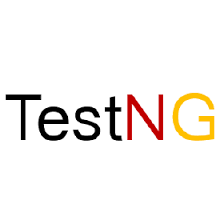

<h1 align="center"> Welcome to my GitHub Page, I'm Valery </h1>

 

<b></b>

<h2 align="center"> I’m Test Automation Engineer </h2>

<h3 align="center"> I write automated tests on Java and always being open to interesting projects</h3>

<h3 align="center"> My work stack: </h3>

<code></code>
<code></code>
<code></code>
<code></code>
<code></code>
<code></code>
<code></code>
<code></code>
<code></code>
<code></code>
<code></code>
<code></code>
<code></code>
<code></code>
<code></code>
<code></code>

### Ways to contact me:

## 📋My completed courses and projects:
### I never stand still and always learn something new. My standard for professional growth is 2-3 completed courses per year

- ✔️ **Java Programming for Testers | Alexey Barantsev | Trainings for QA** 
- [`Click to view certificate`](http://cert.software-testing.ru/362969244439151185)
- ✔️ **School of Test Automation Engineers on Java | Alexey Vinogradov (`Selenide` developer), Artem Eroshenko (`Allure Reports`, `Allure TestOps` developer)**
- [`Click to view certificate`]()
- ✔️ **Automation of REST API testing on Java | Arseny Batyrov | LearnQA**
- [`Click to view certificate`](http://cert.software-testing.ru/365757321050063441)
- ✔️ **Selenium WebDriver: The Complete Guide, the most complete and in-depth course on the `Selenium` tool | Alexey Barantsev (`Selenium` developer) | Trainings for QA**
- [`Click to view certificate`](http://cert.software-testing.ru/369313244459827792)
- ✔️ **JavaRush Course | Blocks `Java Syntax New` and `Java Core` till 20th level**

<code><a href="https://qa.guru/"></code>
<code><a href="https://software-testing.ru/edu/index.php"></code>
<code><a href="https://software-testing.ru/edu/index.php"></code>
<code><a href="https://javarush.com/"></code>

